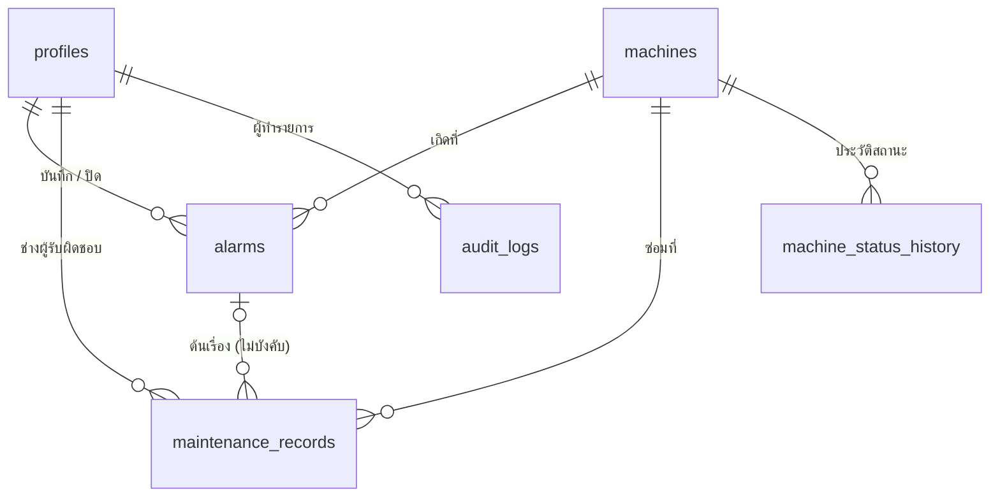

# AMMS — Alarm & Maintenance Management System

[](https://github.com/pornlert-p-bit/amms-alarm-maintenance/actions/workflows/ci.yml)

ระบบเว็บสำหรับจัดการข้อมูลเครื่องจักร บันทึก Alarm และติดตามงานซ่อมบำรุงในโรงงาน
งานรายวิชา **การใช้คอมพิวเตอร์ควบคุมระบบการผลิตอัตโนมัติ** (Programming in Automation Systems) · มหาวิทยาลัยเทคโนโลยีราชมงคลพระนคร

| | |
|---|---|
| **Vercel URL** | https://amms-alarm-maintenance.vercel.app |
| **GitHub** | https://github.com/pornlert-p-bit/amms-alarm-maintenance |
| **Supabase Schema** | [`supabase/schema.sql`](supabase/schema.sql) (ติดตั้งใหม่ไฟล์เดียว) · [`supabase/migrations/`](supabase/migrations/) (ประวัติการแก้) |
| **รายงานการใช้ AI** | [`AI_USAGE_REPORT.md`](AI_USAGE_REPORT.md) |
| **เอกสารออกแบบ** | [`docs/`](docs/README.md) · คู่มือดูแลระบบ [`docs/RUNBOOK.md`](docs/RUNBOOK.md) |

---

## 1. วัตถุประสงค์

โรงงานบันทึก Alarm และงานซ่อมกระจายหลายแหล่ง (สมุด, Excel, กลุ่มแชต) ทำให้ค้นประวัติเครื่องยาก ติดตามไม่ได้ว่างานไหนค้าง และแต่ละฝ่ายเห็นตัวเลขไม่ตรงกัน

AMMS รวม **เครื่องจักร → Alarm → งานซ่อม** ไว้ในระบบเดียว มีสิทธิ์ตามบทบาท มีประวัติที่แก้ย้อนหลังไม่ได้ และมีหน้าจอสรุปแบบห้องควบคุมให้เห็นทันทีว่าเครื่องไหนมีปัญหา
(รายละเอียด Requirement 62 ข้อ: [docs/01-requirement-analysis.md](docs/01-requirement-analysis.md))

## 2. ฟังก์ชันหลัก

| ส่วน | ทำอะไรได้ |
|---|---|
| **Login / Role** | Login–Logout ด้วย Supabase Auth · 3 บทบาท Admin / Technician / Viewer · ผู้ใช้ใหม่ได้ Viewer (สิทธิ์ต่ำสุด) อัตโนมัติ · Admin เปลี่ยน Role ของคนอื่นได้ แต่ของตัวเองไม่ได้ |
| **Machine Master** | CRUD ครบ (Admin) · Machine ID, Name, Type, Location, Status (Running / Stop / Alarm / Maintenance) · ลบแบบ Soft Delete และลบเครื่องที่ยังมี Alarm ค้างไม่ได้ |
| **Alarm Record** | Create / Read / Update · สถานะ Open → In Progress → Closed · ปิดต้องมีสาเหตุ · บันทึกผู้ปิดและเวลาปิดอัตโนมัติ · Alarm ที่ปิดแล้วแก้ไม่ได้ |
| **Maintenance Record** | Create / Read / Update · บอร์ด Kanban 4 คอลัมน์ Open / In Progress / **Waiting Part** / Done · ผูกกับ Alarm ได้ · ปิดงานต้องบันทึกการแก้ไข |
| **Search / Filter** | เครื่องจักร: คำค้น + สถานะ · Alarm: เครื่อง + สถานะ + รหัส + ช่วงวันที่ · งานซ่อม: เครื่อง + ช่าง + ช่วงวันที่ · หน้ารายการเครื่องจักร / Alarm / Audit Log แบ่งหน้าละ 25 รายการ |
| **Dashboard** | จัดแบบจอ SCADA ห้องควบคุม: แถบ Alarm บนสุด (กะพริบเมื่อยังไม่มีผู้รับ) · จำนวนเครื่องแยกสถานะ · Alarm / งานซ่อมค้าง · ผังสายการผลิต · กราฟ Alarm รายวัน 7/30 วัน · Pareto รหัส Alarm · MTTR |
| **Validation** | ช่องจำเป็นห้ามว่าง · Machine ID ห้ามซ้ำและต้องตรงรูปแบบ · เวลา Alarm ห้ามเป็นอนาคต · ตรวจ 3 ชั้น: ฟอร์ม → Server Action (Zod) → Constraint/Trigger ในฐานข้อมูล |

**คะแนนพิเศษ (Bonus)**

| รายการ | ที่ไหน |
|---|---|
| Role Viewer (ดูอย่างเดียว) | ทุกหน้า — ปุ่มแก้ไขซ่อน และฐานข้อมูลปฏิเสธถ้ายิง API ตรง |
| กราฟวิเคราะห์ Alarm | หน้าภาพรวม: รายวัน + Pareto + MTTR |
| Machine History | `/machines/[id]` ไทม์ไลน์ Alarm, งานซ่อม, การเปลี่ยนสถานะ ของเครื่องหนึ่งเครื่อง |
| Audit Log | `/audit` (Admin) บันทึกทุกการเพิ่ม/แก้/ลบ แบบแก้หรือลบย้อนหลังไม่ได้ |
| สถานะ Waiting Part | บอร์ดงานซ่อม |
| Filter ตามช่วงวันที่ | Alarm, งานซ่อม, Audit Log, ประวัติเครื่อง |
| Responsive UI | ใช้บนมือถือได้ทุกหน้า (ทดสอบที่ความกว้าง 375px) |

## 3. เทคโนโลยี

| ส่วน | ใช้อะไร |
|---|---|
| Frontend + Backend | Next.js 16 (App Router, Server Components, Server Actions), React 19, TypeScript |
| UI | Tailwind CSS 4, กราฟด้วย Recharts · ออกแบบตามหลัก ISA-101 (สถานะปกติเป็นสีเทา ใช้สีเฉพาะสิ่งผิดปกติ) |
| ฐานข้อมูล + Login | Supabase (PostgreSQL, Auth, Row Level Security) |
| Validation | Zod |
| Test | Vitest (unit test 129 กรณี) |
| CI | GitHub Actions — Install → Build → Lint → Test ทุกครั้งที่ push |
| Deploy | Vercel (deploy อัตโนมัติจาก branch `main`) |

## 4. สถาปัตยกรรมและความปลอดภัย

```
Browser ──HTTPS──▶ Next.js บน Vercel ──────────────▶ Supabase
                   ① proxy.ts  : ต้อง Login           ③ RLS + Constraint + Trigger
                   ② DAL / authorizeAction : ต้องมี Role ที่ถูกต้อง
```

- **สิทธิ์ถูกบังคับ 3 ชั้น** — การซ่อนปุ่มไม่นับเป็นความปลอดภัย ชั้นที่ ③ ในฐานข้อมูลคือชั้นสุดท้ายที่ยังทำงานแม้มีคนยิง API ตรง ([ADR-002](docs/adr/ADR-002-server-mediated-mutations.md))
- **ใช้แค่ Publishable key** — ไม่มี Secret / Service Role key ในแอปเลย ค่าทั้งหมดอยู่ใน `.env.local` (ไม่ commit) และ Environment Variables ของ Vercel
- **ถอนสิทธิ์ `anon` ทั้งหมด** — คนที่ยังไม่ Login อ่านข้อมูลใดไม่ได้แม้ตารางใหม่จะลืมเปิด RLS ([ADR-006](docs/adr/ADR-006-least-privilege-grants.md))
- **ทดสอบแบบยิง API ตรงทุก Module** แล้วพบช่องโหว่ 5 จุดที่ RLS อย่างเดียวกันไม่ได้ (RLS คุมว่าแก้ "แถว" ไหนได้ แต่ไม่คุมว่าแก้ "คอลัมน์" ไหนเป็นค่าอะไรได้) — แก้ด้วย trigger / สิทธิ์ระดับคอลัมน์ใน migration 003–005, 007, 008 และทดสอบซ้ำทั้งก่อน/หลังแก้ ([รายงานทดสอบ](docs/test-reports/))

## 5. โครงสร้างฐานข้อมูล



| ตาราง | คอลัมน์สำคัญ | กฎที่ฐานข้อมูลบังคับ |
|---|---|---|
| `profiles` | id (= auth.users), full_name, role | สร้างอัตโนมัติเป็น viewer · แก้ได้เฉพาะ role · ห้ามแก้ของตัวเอง |
| `machines` | machine_id (UNIQUE), machine_name, machine_type, location, status, deleted_at | รูปแบบรหัส `A-Z 0-9 -` 2–20 ตัว · ลบแบบ soft delete |
| `alarms` | machine_id (FK restrict), alarm_code, description, occurred_at, status, cause, created_by, closed_by, closed_at | ปิดต้องมี cause · ห้ามเวลาอนาคต · ลำดับสถานะ · ผู้ปิด/เวลาปิดมาจากระบบ · ปิดแล้วแก้ไม่ได้ |
| `maintenance_records` | machine_id, alarm_id (ไม่บังคับ), technician_id, problem, action_taken, maintained_at, status | Done ต้องมี action_taken · Alarm ต้องเป็นของเครื่องเดียวกัน · ช่างต้องเป็น admin/technician |
| `machine_status_history` | machine_id, from_status, to_status, source, changed_at | บันทึกโดย trigger เมื่อสถานะเครื่องเปลี่ยน |
| `audit_logs` | actor_id, actor_role, action, entity_type, entity_id, before_data, after_data | append-only · Role และเวลาบังคับจากระบบ ปลอมไม่ได้ |

สถานะทั้งหมดเป็น PostgreSQL enum · รายละเอียด DDL, ERD และ RLS Policy: [docs/04-database-schema.md](docs/04-database-schema.md)

## 6. ติดตั้งและใช้งาน

**สิ่งที่ต้องมี:** Node.js 24, บัญชี Supabase (แผน Free ได้)

```bash
git clone https://github.com/pornlert-p-bit/amms-alarm-maintenance.git
cd amms-alarm-maintenance
npm ci
cp .env.example .env.local        # ใส่ Supabase URL และ Publishable key
npm run dev                       # เปิด http://localhost:3000
```

**ตั้งค่า Supabase ครั้งแรก** (ละเอียดใน [RUNBOOK ข้อ 2](docs/RUNBOOK.md))
1. สร้าง project แล้วรัน [`supabase/schema.sql`](supabase/schema.sql) ใน SQL Editor ทั้งไฟล์
2. สร้างผู้ใช้ที่ Authentication → Users (ระบบให้ Role viewer อัตโนมัติ) แล้วยกระดับ admin คนแรกด้วย SQL ใน RUNBOOK ข้อ 2.2 — หลังจากนั้นเปลี่ยน Role คนอื่นที่หน้า `/users`
3. (ไม่บังคับ) ข้อมูลสาธิต Alarm ย้อนหลัง 30 วัน: [`supabase/seed/demo_alarm_history.sql`](supabase/seed/demo_alarm_history.sql)

| คำสั่ง | ทำอะไร |
|---|---|
| `npm run dev` | รันโหมดพัฒนา |
| `npm run build` / `npm start` | build และรันแบบ production |
| `npm run lint` | ตรวจรูปแบบโค้ด |
| `npm run typecheck` | ตรวจชนิดข้อมูล TypeScript |
| `npm test` | รัน unit test |

**สิทธิ์ตามบทบาท**

| Role | ดูข้อมูล | บันทึก Alarm / งานซ่อม | จัดการเครื่องจักร | ผู้ใช้ + Audit Log |
|---|---|---|---|---|
| Admin | ✅ | ✅ | ✅ | ✅ |
| Technician | ✅ | ✅ | — | — |
| Viewer | ✅ | — | — | — |

> บัญชีทดสอบสำหรับผู้ประเมินส่งแยกให้ทางช่องทางส่งงาน — ไม่เขียนรหัสผ่านไว้ใน repository สาธารณะ

## 7. ภาพหน้าจอ

> _(จะเพิ่มภาพจาก production ในโฟลเดอร์ `docs/screenshots/`)_

## 8. การใช้ AI ในการพัฒนา

ใช้ **Claude Code** (โมเดล Claude Opus 5.5) ช่วยในทุกขั้นตอน ตั้งแต่วิเคราะห์ Requirement, ออกแบบ, เขียนโค้ด, เขียนเทสต์ ไปจนถึงทดสอบผ่านเบราว์เซอร์และยิง API ตรงเพื่อหาช่องโหว่

| AI ช่วยทำ | ผู้พัฒนาตัดสินใจ / ทำเอง |
|---|---|
| ร่างเอกสารออกแบบ 6 ไฟล์ และ ADR 7 ฉบับ | ขอบเขตงาน และตรวจเอกสารก่อนเริ่มเขียนโค้ด |
| เขียนโค้ดทุก Module, SQL, migration และ unit test | เลือกแนวหน้าจอ (Station terminal จากโปรเจกต์ One Card ของตนเอง และหน้าภาพรวมแบบ SCADA) |
| ทดสอบในเบราว์เซอร์และยิง API ตรงหาช่องโหว่ | อนุมัติ library ใหม่ทุกตัว, รัน migration ใน Supabase, สร้างบัญชี/ถือรหัสผ่าน, Login ทุก Role เพื่อทดสอบ |
| เขียนรายงานทดสอบและ RUNBOOK | ตั้งค่า GitHub, Vercel, Supabase และอนุญาตทุกครั้งก่อน push / แตะฐานข้อมูลจริง |

รายละเอียด รวมถึง **จุดที่ AI ทำผิดและวิธีที่ตรวจเจอ**: [AI_USAGE_REPORT.md](AI_USAGE_REPORT.md)

## 9. เอกสารเพิ่มเติม

| เอกสาร | เนื้อหา |
|---|---|
| [docs/README.md](docs/README.md) | สารบัญเอกสารออกแบบ (Requirement → Design → Architecture → Database → Traceability → Review) |
| [docs/05-traceability.md](docs/05-traceability.md) | Requirement ทุกข้อ → โค้ด → ผลทดสอบ |
| [docs/test-reports/](docs/test-reports/) | ผลทดสอบแต่ละ Module (หน้าเว็บ + ยิง API ตรง) |
| [docs/adr/](docs/adr/) | เหตุผลของการตัดสินใจสำคัญ 7 เรื่อง |
| [docs/RUNBOOK.md](docs/RUNBOOK.md) | คู่มือดูแลระบบ: แก้ปัญหา, backup/restore, ส่วนที่ควรให้คน review |
