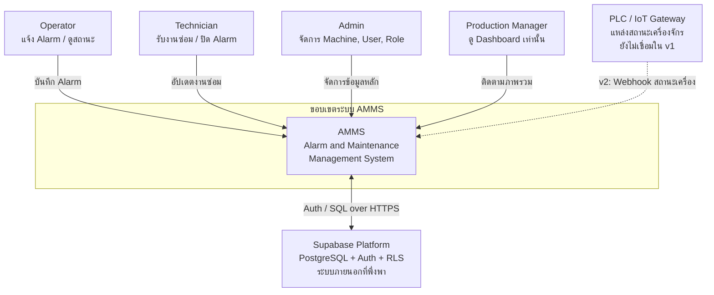
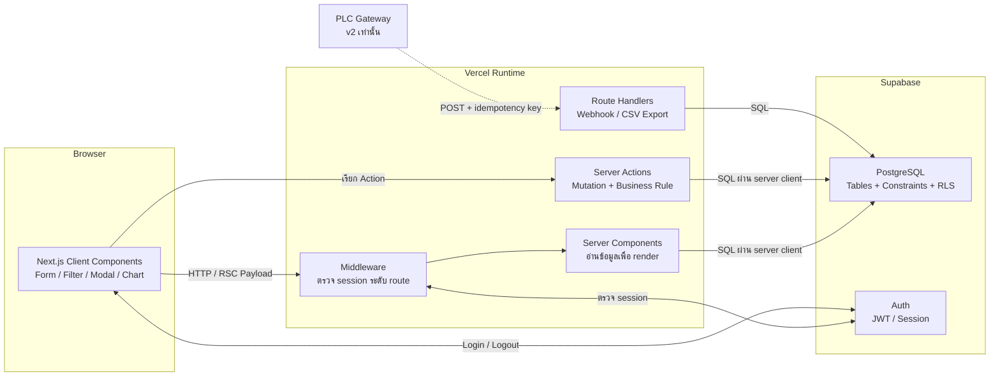
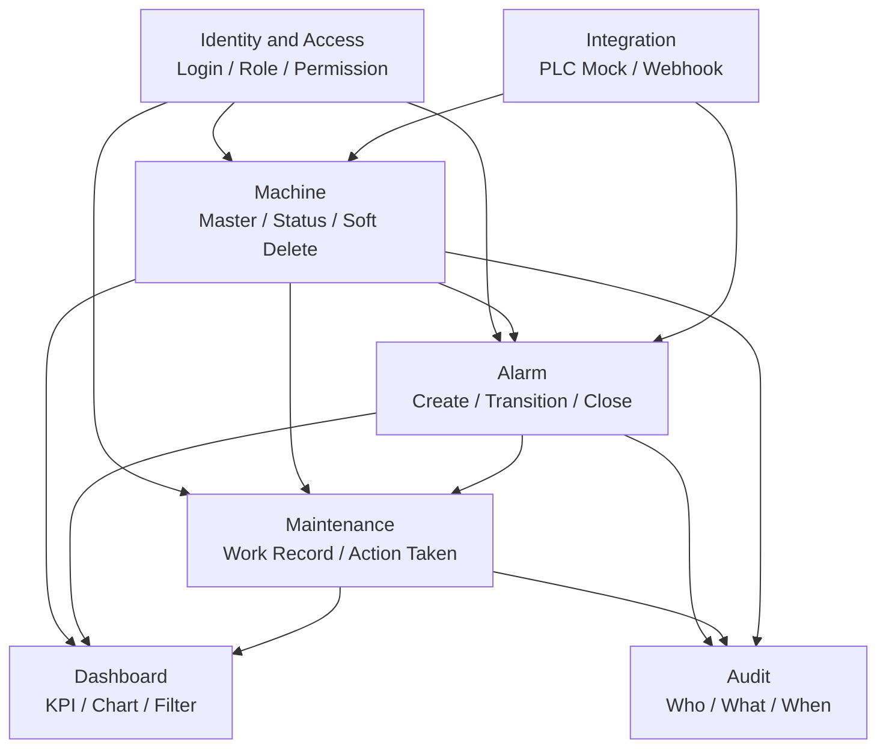
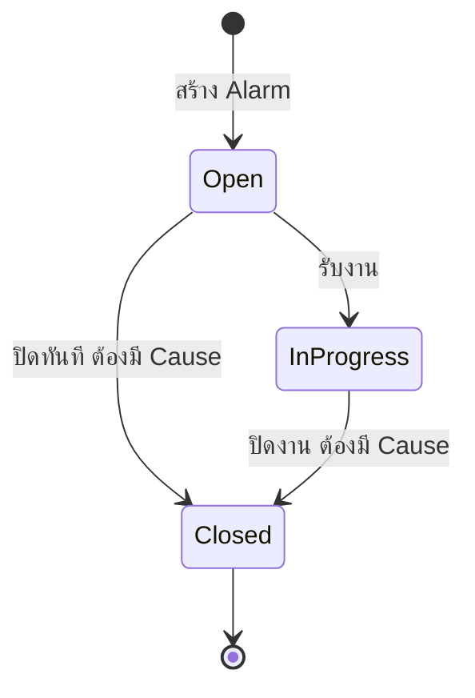
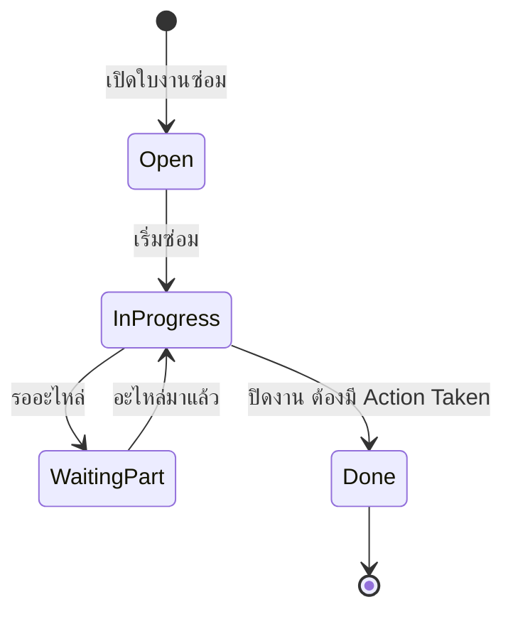
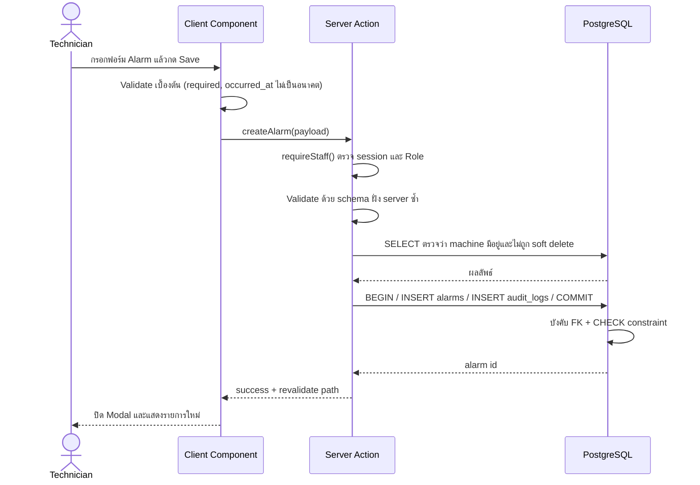
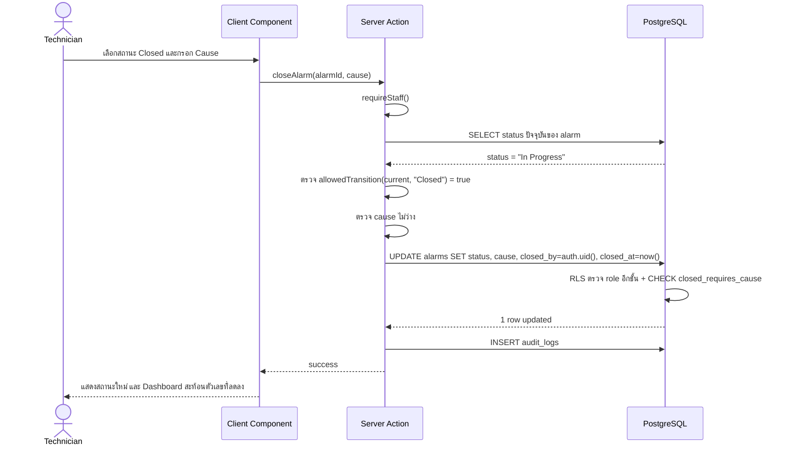
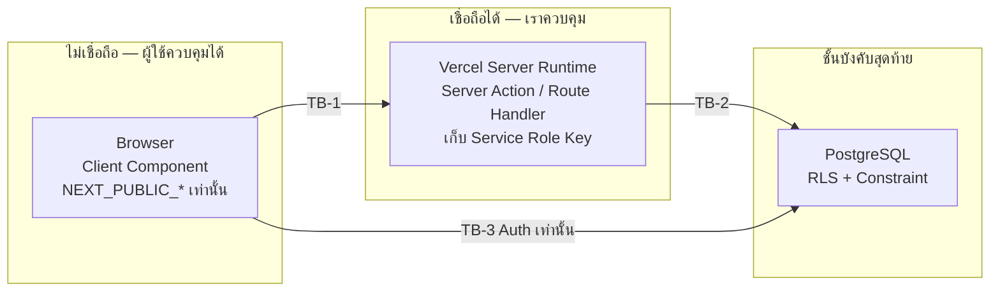

# 02 — System Design

**ระบบ:** Alarm & Maintenance Management System (AMMS)
**อ้างอิง Requirement:** [01-requirement-analysis.md](01-requirement-analysis.md) — Baseline v1.0
**วันที่:** 21 กันยายน 2569
**สถานะเอกสาร:** Accepted v1.0

> อ้างอิงแนวทางจากเอกสารประกอบการสอน Chapter 02 — System Design
> Requirement = *What / Why* • System Design = *How at system level* • Implementation = *Code detail*

---

## 1. System Context

ขอบเขตของระบบ (System Boundary) คือ **AMMS Web Application ทั้งชุด** ซึ่งเป็นเจ้าของข้อมูล (System of Record) ของ Machine Master, Alarm Record, Maintenance Record และ Audit Log ส่วนสถานะเครื่องจักรแบบสด (Live Status) ในอนาคตจะมี PLC เป็นเจ้าของ

### 1.1 คำตอบของคำถามกำหนด Boundary

| คำถาม | คำตอบ |
|---|---|
| ผู้ใช้กลุ่มใดใช้ระบบโดยตรง? | Operator, Technician, Admin, Production Manager (ผ่าน 3 Role) |
| ข้อมูลใดระบบเป็นเจ้าของ? | Machine Master, Alarm, Maintenance, Profile/Role, Audit Log |
| ข้อมูลใดมาจากภายนอก? | ตัวตนผู้ใช้ (Supabase Auth) และในอนาคตคือ Machine Live Status (PLC) |
| ระบบภายนอกใดต้องเชื่อม? | Supabase (v1) และ PLC/IoT Gateway (v2) — ไม่เชื่อม ERP/MES |
| อะไร **ไม่ใช่** หน้าที่ของระบบนี้? | Control Loop ของเครื่องจักร, Interlock ความปลอดภัย, การสั่งงานเครื่องจักร, จัดการสต็อกอะไหล่ |
| ถ้าระบบภายนอกล่ม ระบบเราทำงานต่อได้แค่ไหน? | Supabase ล่ม = ระบบอ่าน/เขียนไม่ได้ ต้องแสดง Error State ที่ชัด • PLC Gateway ล่ม (v2) = ยังบันทึก Alarm/งานซ่อมด้วยมือได้ แต่ต้องแสดง `last_seen_at` ของข้อมูลสถานะ |

---

## 2. Container-Level Architecture

### 2.1 หน้าที่และสิ่งที่ไม่ควรรับผิดชอบ

| ชั้น | หน้าที่ | สิ่งที่ไม่ควรรับผิดชอบ |
|---|---|---|
| Client Components | รับ Input, แสดงผล, Interaction, Validation เพื่อ UX | ถือ Secret, เป็นด่านเดียวของ Business Rule, เรียก PLC ตรง |
| Server Components | ดึงข้อมูลและ Render ฝั่ง Server | ทำ Mutation, ผูกกับ state ของ Browser |
| Server Actions | บังคับ Business Rule, ตรวจ Authorization, เขียนข้อมูล + Audit | ผูกกับรายละเอียด UI, คืนค่า Secret |
| Route Handlers | รับ Webhook จากภายนอก, ส่งไฟล์ Export | เป็น API ครอบทุก Query ที่ Server Component ทำได้แล้ว |
| PostgreSQL | เก็บข้อมูล, Constraint, Relationship, Transaction, RLS Policy | เก็บ Business Logic ทั้งหมดไว้ใน Trigger จนตามยาก |

> **ADR-001** ตัดสินใช้ Modular Monolith บน Next.js App Router ไม่แยก Microservices — ดู [adr/ADR-001-modular-monolith.md](adr/ADR-001-modular-monolith.md)

---

## 3. Module Decomposition

แบ่งตาม Business Capability ไม่ใช่ตามชื่อหน้า UI เพื่อให้ยังคง High Cohesion / Low Coupling

### 3.1 Module Responsibility Table

| Module | Responsibility หลัก | ข้อมูลที่ดูแล | REQ ที่รองรับ |
|---|---|---|---|
| Identity & Access | ยืนยันตัวตน, แปลง Session เป็น Role, บังคับสิทธิ์ | `profiles` | REQ-AUTH-01…06, REQ-SEC-01, REQ-SEC-02 |
| Machine | ข้อมูลหลักของเครื่องจักรและสถานะปัจจุบัน | `machines`, `machine_status_history` | REQ-MCH-01…06, REQ-BON-03 |
| Alarm | วงจรชีวิตของ Alarm และกฎการเปลี่ยนสถานะ | `alarms` | REQ-ALM-01…06 |
| Maintenance | งานซ่อมบำรุงและผลการแก้ไข | `maintenance_records` | REQ-MNT-01…05, REQ-BON-07 |
| Dashboard | อ่านและสรุปข้อมูล (read-only) | Aggregate View | REQ-DSH-01…05, REQ-BON-02 |
| Audit | บันทึกร่องรอยการเปลี่ยนแปลงข้อมูลสำคัญ | `audit_logs` | REQ-SEC-06, REQ-BON-05, NFR-OBS-01 |
| Integration | จุดรับข้อมูลสถานะจากฝั่ง OT (v1 = Simulator) | เขียนผ่าน Machine + Alarm | REQ-BON-09 |

**เหตุที่แยก Dashboard เป็น Module:** Dashboard เป็น **ผู้อ่านอย่างเดียว** ไม่มีสิทธิ์เขียนข้อมูลของ Module อื่น ทำให้เพิ่มกราฟหรือ KPI ใหม่ได้โดยไม่แตะ Business Rule ของ Alarm/Maintenance (รองรับ NFR-MAINT-01)

**เหตุที่แยก Integration เป็น Module:** เพื่อให้เปลี่ยนจาก Simulator เป็น PLC Gateway จริงใน v2 ได้โดยแตะ Module เดียว — Alarm/Maintenance/Dashboard ไม่ต้องแก้

---

## 4. State Machine ของสถานะ

การกำหนด Transition ที่อนุญาตไว้ล่วงหน้าทำให้เขียน Test และ CHECK constraint ได้ตรง ๆ

| Entity | Transition ที่อนุญาต | Transition ที่ต้องปฏิเสธ |
|---|---|---|
| Alarm | Open→In Progress, Open→Closed, In Progress→Closed | ทุกอย่างที่ออกจาก Closed (BR-02) |
| Maintenance | Open→In Progress, In Progress↔Waiting Part, In Progress→Done | Done→อื่น ๆ, Open→Done (ต้องผ่าน In Progress) |
| Machine | Running↔Stop↔Alarm↔Maintenance (อิสระ) | เปลี่ยนผ่านฟอร์มทั่วไปเมื่อแหล่งที่มาเป็น PLC (BR-09) |

---

## 5. Dynamic Flow

### 5.1 Use Case: Create Alarm

### 5.2 Use Case: Close Alarm

### 5.3 Rule ของ Close Alarm (เรียงลำดับการตรวจ)

| ลำดับ | Rule | ตรวจที่ | ถ้าไม่ผ่าน |
|---|---|---|---|
| 1 | ผู้ใช้ต้อง Login | Middleware | Redirect ไป `/login` |
| 2 | Role ต้องเป็น Admin หรือ Technician | Server Action + RLS | คืน error `FORBIDDEN` |
| 3 | Alarm ต้องอยู่สถานะ Open หรือ In Progress | Server Action | คืน error `INVALID_TRANSITION` |
| 4 | ต้องมี Cause ไม่ว่าง | Server Action + CHECK constraint | คืน error ระบุ field `cause` |
| 5 | closed_by / closed_at กำหนดโดย server เท่านั้น | Server Action (ไม่รับจาก payload) | — |
| 6 | เขียน Audit Log ในทรานแซกชันเดียวกัน | Server Action | Rollback ทั้งชุด |
| 7 | Revalidate path ของ Alarm และ Dashboard | Server Action | ข้อมูลบนหน้าจอไม่อัปเดต |

> **จุดสำคัญ:** ข้อ 2 และ 4 ถูกบังคับ **สองชั้น** (Server Action + Database) ตาม NFR-SEC-01 และ NFR-INT-01 — การซ่อนปุ่มใน UI ไม่นับเป็น Authorization

---

## 6. Failure Mode Table

| # | Failure | ผลกระทบ | แนวทางออกแบบ |
|---|---|---|---|
| FM-01 | Supabase timeout ขณะบันทึก | บันทึกไม่สำเร็จ แต่ผู้ใช้อาจเข้าใจว่าสำเร็จ | Server Action คืน error ชัดเจน, **ห้ามแสดง success ก่อนได้ผลจาก DB**, ไม่ retry อัตโนมัติสำหรับ INSERT |
| FM-02 | ผู้ใช้กด Save ซ้ำ | เกิดข้อมูลซ้ำ | Disable ปุ่มระหว่าง pending + Unique Constraint (machine) + ตรวจ transition ทำให้ UPDATE ซ้ำไม่มีผล (idempotent) |
| FM-03 | Session / JWT หมดอายุระหว่างกรอกฟอร์ม | Mutation ถูกปฏิเสธ ผู้ใช้เสียข้อมูลที่กรอก | Middleware refresh session, ถ้าหมดจริงให้ Redirect ไป Login พร้อมเก็บ `returnTo` และไม่ล้างค่าในฟอร์ม |
| FM-04 | Technician เรียก API แก้ Machine โดยตรง | สิทธิ์รั่ว | RLS `admin write machines` ปฏิเสธที่ชั้น DB แม้ข้าม UI/Server Action (QAS-03) |
| FM-05 | Query Alarm จำนวนมากบน Dashboard | หน้า Dashboard ช้า | Aggregate + index บน `status`, `occurred_at`; Pagination 25 แถว/หน้า; ไม่ดึงทุกแถวมานับที่ Client |
| FM-06 | PLC Gateway offline (v2) | สถานะเครื่องค้างเป็นข้อมูลเก่า | แสดง `last_seen_at` และป้าย "ข้อมูลล้าสมัย" — **ห้ามแสดงข้อมูลเก่าเป็นสถานะปัจจุบันโดยไม่บอก** |
| FM-07 | Gateway ส่ง Alarm ซ้ำหลัง retry (v2) | Alarm ซ้ำในระบบ | Route Handler ใช้ `event_id` เป็น idempotency key + Unique Constraint ปฏิเสธซ้ำ |
| FM-08 | Admin ลบ Machine ที่ยังมี Alarm ค้าง | ประวัติกำพร้าหรือข้อมูลหาย | FK `on delete restrict` + Soft Delete + BR-05 ปฏิเสธที่ Server Action พร้อมข้อความอธิบาย |
| FM-09 | Build บน Vercel สำเร็จแต่ Environment Variable ไม่ครบ | ระบบขึ้นแต่ Login ไม่ได้ | CI มีขั้น Build ที่ใช้ env จาก Secrets + ตรวจ env ที่ต้องมีตอน bootstrap และ fail เร็วพร้อมข้อความชัด |

### 6.1 Graceful Failure

- ระบบต้องล้มแบบ **เข้าใจได้** — Error State มีข้อความ สาเหตุ และปุ่มลองใหม่ ไม่ใช่หน้าว่าง (NFR-AVAIL-01)
- แยก **Transient failure** (timeout, network) ออกจาก **Permanent failure** (สิทธิ์ไม่พอ, ข้อมูลผิด) — เฉพาะแบบแรกที่ควรเสนอให้ลองใหม่
- ไม่ retry อัตโนมัติสำหรับ Request ที่สร้างข้อมูล

---

## 7. Security และ Trust Boundary

| # | Trust Boundary | ความเสี่ยง | มาตรการ |
|---|---|---|---|
| TB-1 | Browser → Server Action | ผู้ใช้ปลอม payload เช่นส่ง `closed_by` หรือ `role` มาเอง | Server Action รับเฉพาะ field ที่อนุญาต (allow-list) และ **กำหนด `closed_by`/`closed_at`/`created_by` จาก session เอง** ไม่รับจาก client |
| TB-2 | Server → Database | Server ใช้สิทธิ์เกินจำเป็น | ใช้ Anon Key + Session ของผู้ใช้เป็นค่าตั้งต้นเพื่อให้ RLS ทำงาน; ใช้ Service Role Key **เฉพาะงาน admin ที่จำเป็นจริง** และเรียกจากไฟล์ที่เป็น server-only |
| TB-3 | Browser → Supabase ตรง | Client เขียนข้อมูลข้าม Business Rule | v1 อนุญาตให้ Client เรียก Supabase ตรงเฉพาะ **Auth (login/logout)** เท่านั้น — ทุก Query/Mutation ของข้อมูลธุรกิจผ่าน Server (ADR-002) |
| TB-4 | Role → Business Operation | ซ่อนปุ่มแล้วคิดว่าปลอดภัย | บังคับ 3 ชั้น: Middleware (route) → Server Action guard (`requireAdmin`/`requireStaff`) → RLS Policy |
| TB-5 | สิทธิ์ระดับฐานข้อมูล | `anon` มีสิทธิ์ DML ทำให้ตารางใหม่ที่ลืมเปิด RLS รั่วทันที | **Grant ให้ `authenticated` เท่านั้น** ไม่ grant ให้ `anon` และไม่ตั้ง `alter default privileges` แบบเปิดกว้าง (REQ-SEC-05) |
| TB-6 | PLC Gateway → Route Handler (v2) | อุปกรณ์ปลอมยิงข้อมูลเข้าระบบ | ตรวจ Shared Secret/Signature ใน header, allow-list machine id, จำกัด rate, validate payload ก่อนเขียน |

### 7.1 Security Design Checklist

| ประเด็น | คำตอบของระบบนี้ |
|---|---|
| Identity — รู้ไหมว่า request มาจากใคร? | ทุก Server Action อ่าน session จาก Supabase Auth ก่อนทำงาน |
| Authorization — ผู้ใช้นี้ทำ operation นี้ได้จริงไหม? | ตรวจ Role ที่ Server Action และ RLS Policy ซ้ำอีกชั้น |
| Secrets — key รั่วไป client หรือ repo ไหม? | Service Role Key อยู่ใน Environment Variable ฝั่ง server, `.env.local` อยู่ใน `.gitignore`, commit เฉพาะ `.env.local.example` |
| Data Access — user อ่าน/เขียนเกินสิทธิ์ไหม? | RLS ทุกตาราง, `anon` ไม่มีสิทธิ์ใด ๆ |
| Audit — operation สำคัญตามย้อนกลับได้ไหม? | `audit_logs` บันทึก actor, action, entity, before/after |
| Input — validate ข้อมูลจาก client/external ไหม? | Validate 3 ชั้น (Client เพื่อ UX, Server Action ด้วย schema, Database ด้วย Constraint) |

---

## 8. Quality Attributes

| Quality Attribute | คำถาม | Design Response ของระบบนี้ |
|---|---|---|
| Security | ใครเข้าถึงอะไรได้? Secret อยู่ไหน? | 3 Role + RLS ทุกตาราง, Secret ฝั่ง server เท่านั้น, `anon` ไม่มีสิทธิ์ (TB-1…TB-6) |
| Reliability | ถ้า DB ล่มชั่วคราวจะเกิดอะไร? | Error State ที่อธิบายได้, ไม่ retry อัตโนมัติสำหรับ INSERT, transaction ครอบการเขียน + audit (FM-01, FM-02) |
| Performance | จุดไหนอาจช้า? | Aggregate ฝั่ง DB, index บน `status`/`occurred_at`/`machine_id`, Pagination 25 แถว (NFR-PERF-01, NFR-PERF-02) |
| Maintainability | แก้ Module หนึ่งกระทบอีก Module แค่ไหน? | แบ่งตาม Business Capability, Dashboard อ่านอย่างเดียว, สถานะเป็น Enum จุดเดียว (NFR-MAINT-01) |
| Observability | รู้ได้อย่างไรว่าระบบมีปัญหา? | Audit Log แยกจาก Application Log, Log มี Context (use case + entity id + reason) |
| Scalability | เมื่อข้อมูลโตจะตันตรงไหน? | Query ของ Dashboard และหน้ารายการ — แก้ด้วย index + pagination ก่อนคิดถึง cache |
| Cost | ต้นทุนระยะยาว? | ใช้ Free Tier ของ Vercel + Supabase, Modular Monolith ทำให้ไม่มีค่าใช้จ่าย service ซ้ำซ้อน |

### 8.1 Trade-off ที่ยอมรับ

| เลือก | ได้ | เสีย / ต้องระวัง |
|---|---|---|
| ทุก Mutation ผ่าน Server Action | Business Rule และ Audit อยู่จุดเดียว บังคับได้จริง | เพิ่ม hop และโค้ดมากกว่าเรียก Supabase ตรงจาก Client |
| ไม่ใช้ Realtime Subscription ใน v1 | ลด complexity เรื่อง connection และลำดับ event | Dashboard ไม่อัปเดตเอง ต้อง refresh หรือ revalidate |
| ใช้ Enum ของ Postgres สำหรับสถานะ | ค่าผิดเข้าฐานข้อมูลไม่ได้เลย | เพิ่มค่าใหม่ต้องรัน migration (`ALTER TYPE`) ไม่ใช่แค่แก้โค้ด |
| Soft Delete แทน Hard Delete | ประวัติไม่หาย ตรวจย้อนหลังได้ | ทุก Query ต้องกรอง `deleted_at is null` — ลืมที่ใดที่หนึ่งแล้วข้อมูลที่ลบจะโผล่ |
| ยังไม่เชื่อม PLC จริง แต่กำหนด Interface ไว้ | ส่งงานได้ทันเวลาและขยายต่อได้ | ต้องมี Simulator ที่สะท้อนพฤติกรรมจริงพอสมควร |

---

## 9. Observability

### 9.1 สิ่งที่ต้องเห็นเมื่อระบบทำงาน

| ประเภท | เนื้อหา |
|---|---|
| Application Error | เกิดที่ use case ไหน, entity id อะไร, สาเหตุอะไร |
| Audit Event | ใครเปลี่ยนสถานะอะไร จากค่าใดเป็นค่าใด เมื่อไร |
| Performance | Query ใดของ Dashboard ใช้เวลานาน |
| Deployment Version | Commit SHA ที่กำลังรันอยู่ (แสดงท้าย Sidebar) |

### 9.2 Audit Log ≠ Application Log

| | Audit Log | Application Log |
|---|---|---|
| เป้าหมาย | Accountability — ใครทำอะไรกับข้อมูลธุรกิจ | หาสาเหตุทางเทคนิค |
| เก็บที่ | ตาราง `audit_logs` ใน PostgreSQL | Vercel Runtime Log |
| ผู้เข้าถึง | Admin ผ่านหน้าในระบบ | ผู้พัฒนา |
| ตัวอย่าง | `alarm.close` โดย `U22` บน `ALM-103` | `closeAlarm failed: alarm_id=ALM-103, user=U22, reason=invalid_transition` |

### 9.3 รูปแบบ Log ที่ใช้

| ไม่ดี | ที่ใช้ในระบบนี้ |
|---|---|
| `Error occurred` | `closeAlarm failed: alarm_id=ALM-103, user=U22, reason=permission_denied` |
| `DB error` | `createMaintenance failed: constraint=maintenance_machine_fk, machine_id=M-999` |
| `Save failed` | `createMachine failed: constraint=machines_machine_id_key, machine_id=M-001` |

---

## 10. Design Decisions (ADR)

| ADR | หัวข้อ | สถานะ |
|---|---|---|
| [ADR-001](adr/ADR-001-modular-monolith.md) | ใช้ Modular Monolith บน Next.js App Router สำหรับ v1 | Accepted |
| [ADR-002](adr/ADR-002-server-mediated-mutations.md) | Mutation ทั้งหมดผ่าน Server Action โดยมี RLS เป็นชั้นสุดท้าย | Accepted |
| [ADR-003](adr/ADR-003-status-enum-and-db-constraints.md) | สถานะเป็น Postgres Enum และบังคับ Business Rule ด้วย CHECK Constraint | Accepted |
| [ADR-004](adr/ADR-004-plc-integration-boundary.md) | กำหนด Integration Boundary ของ PLC ไว้ล่วงหน้า แต่ v1 ใช้ Simulator | Accepted |
| [ADR-005](adr/ADR-005-audit-log-in-server-action.md) | เขียน Audit Log จาก Server Action ไม่ใช้ Database Trigger | Accepted |
| [ADR-006](adr/ADR-006-least-privilege-grants.md) | ให้สิทธิ์ฐานข้อมูลเฉพาะ `authenticated` และ Default Deny | Accepted |
| [ADR-007](adr/ADR-007-station-terminal-ui.md) | หน้าจอแบบ Station terminal ตามแนว ISA-101 | Accepted |

---

## 11. Change Impact Analysis

เตรียมไว้ล่วงหน้าสำหรับ Change Request ตัวอย่างในโจทย์ — แต่ละรายการระบุว่ากระทบอะไรบ้าง ไม่ใช่แค่ "แก้หน้า UI"

| Change Request | Data | Logic | Security | UI | Test | ประเมิน |
|---|---|---|---|---|---|---|
| เพิ่มสถานะ `Waiting Part` | `ALTER TYPE mnt_status` | เพิ่ม transition | — | Label + Filter | เพิ่ม 2 เคส | **ทำไว้แล้วใน v1** |
| เพิ่ม Filter ตามช่วงวันที่ | index บน `occurred_at` | query param | — | Date range picker | 1 เคส | **ทำไว้แล้วใน v1** |
| เพิ่ม Role `Viewer` | `ALTER TYPE user_role` | guard + RLS policy | ทุก policy ต้องทบทวน | ซ่อนเมนู | 3 เคส | **ทำไว้แล้วใน v1** |
| เพิ่มหน้า Machine History | ตาราง `machine_status_history` | query รวม 3 แหล่ง | RLS ตารางใหม่ | หน้าใหม่ | 2 เคส | **ทำไว้แล้วใน v1** |
| เพิ่มกราฟจำนวน Alarm | — | aggregate query | — | Chart component | 1 เคส | **ทำไว้แล้วใน v1** |
| เพิ่มข้อมูล Technician | คอลัมน์ใน `profiles` | — | RLS `profiles` | หน้า Users | 1 เคส | ต่ำ — เพิ่มคอลัมน์ |
| รับ Machine Status จาก PLC ทุก 5 วินาที | `machine_status_history` + `last_seen_at` | Route Handler + idempotency | TB-6 ตรวจ signature | ป้าย stale data | 3 เคส | ปานกลาง — **แตะ Module Integration เดียว** (ADR-004) |
| ส่ง Notification เมื่อเกิด Alarm | ตาราง outbox | async job | secret ของผู้ให้บริการ | ตั้งค่าแจ้งเตือน | 2 เคส | สูง — ต้องคิด retry/ordering |

---

## 12. Design Review

ผลการตรวจแบบก่อนเขียนโค้ดอยู่ใน [06-design-review.md](06-design-review.md)

---

## สรุป

System Design นี้แบ่งระบบเป็น 7 Module ตาม Business Capability บนสถาปัตยกรรม Modular Monolith เดียว โดยมี **จุดบังคับสิทธิ์ 3 ชั้น** และ **Business Rule ที่บังคับทั้งใน Server Action และ Database** ครอบคลุม Failure Mode 9 กรณีและ Trust Boundary 6 จุด พร้อม Integration Interface ที่เตรียมรับ PLC ใน v2 โดยไม่ต้องรื้อ Module อื่น
