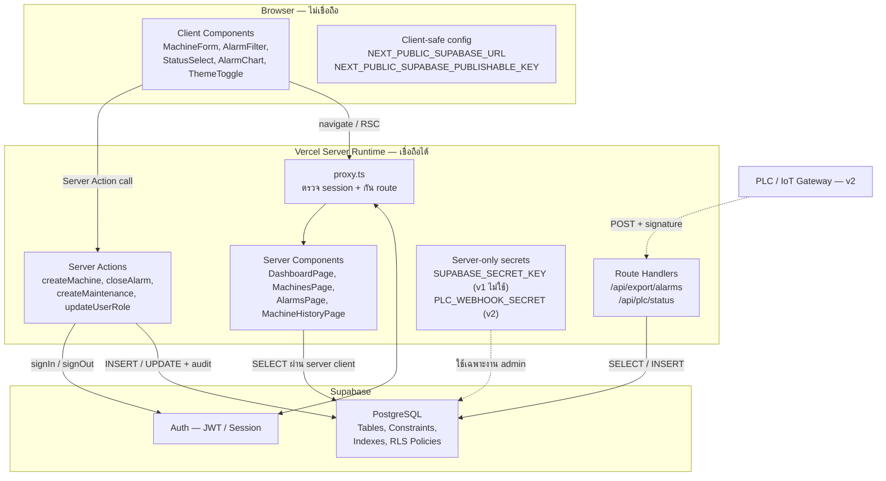
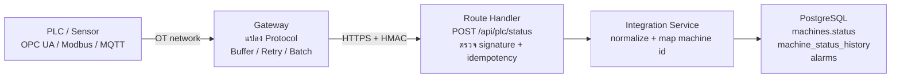

# 03 — Frontend / Backend / Database Architecture

**ระบบ:** Alarm & Maintenance Management System (AMMS)
**อ้างอิง:** [01-requirement-analysis.md](01-requirement-analysis.md) · [02-system-design.md](02-system-design.md)
**Stack:** Next.js 16 (App Router) · TypeScript · Tailwind CSS · Supabase (PostgreSQL + Auth + RLS) · Vercel
**วันที่:** 21 กันยายน 2569

> อ้างอิงแนวทางจากเอกสารประกอบการสอน Chapter 03
> คำถามที่เอกสารนี้ต้องตอบให้ได้: *"Code นี้ควรอยู่ที่ไหน ข้อมูลนี้ควรเชื่อใคร Secret อยู่ตรงไหน และเมื่อ Requirement เปลี่ยนต้องแก้ส่วนใด"*

---

## 1. Architecture Diagram



**หลักที่ใช้:** Next.js Project เดียวมีทั้ง Frontend และ Backend ได้ สิ่งที่แบ่งจริงคือ **Runtime และ Security Boundary** ไม่ใช่โฟลเดอร์

---

## 2. Responsibility Table

| Layer | หน้าที่หลัก | สิ่งที่ห้ามทำ |
|---|---|---|
| **Frontend** (Client Components) | แสดง UI, รับ Input, Interaction, Client state, Validation เพื่อ UX, แสดง Error/Empty/Loading state | ถือ Secret · เป็นด่านเดียวของ Business Rule · เรียก Supabase เพื่อเขียนข้อมูลธุรกิจ · เชื่อว่า input ที่ผ่าน validate ฝั่งตัวเองแล้วปลอดภัย |
| **Backend** (Server Components / Actions / Route Handlers) | ดึงข้อมูลเพื่อ render, ตรวจ Authentication + Authorization, บังคับ Business Rule, เขียน Audit, จัดการ Secret, เชื่อมระบบภายนอก | ส่ง Secret กลับไป Client · ผูกกับรายละเอียด UI · สร้าง API ซ้ำซ้อนกับสิ่งที่ Server Component ทำได้แล้ว |
| **Database** (PostgreSQL) | เก็บข้อมูล, Data Type, PK/FK, Unique & CHECK Constraint, Transaction, RLS Policy | เก็บ Business Logic ทั้งหมดใน Trigger จนตามยาก · เป็นเพียง key-value store ที่ไม่มี integrity |
| **Integration** (Module Integration) | แปลง Protocol, ตรวจตัวตนอุปกรณ์, Normalize ข้อมูล, Buffer/Retry, กัน Event ซ้ำ | ทำให้ Core Logic ผูกกับ Vendor เดียว · ให้ Browser คุยกับ PLC ตรง |

---

## 3. Client / Server Component Inventory

### 3.1 Server Components (เริ่มจากตัวนี้เป็นค่าตั้งต้น)

| Component / Page | หน้าที่ | เหตุผลที่เป็น Server |
|---|---|---|
| `app/(app)/dashboard/page.tsx` | ดึง Aggregate สรุปสถานะ + Alarm ล่าสุด | ดึงข้อมูลฝั่ง server และ render ตรง ไม่ต้องสร้าง API ภายใน |
| `app/(app)/machines/page.tsx` | ดึงรายการ Machine ตาม search/filter/pagination | Query ต้องอยู่ฝั่ง server เพื่อไม่ดึงทั้งตารางไป Client (NFR-PERF-02) |
| `app/(app)/alarms/page.tsx` | ดึงรายการ Alarm ตาม filter | เหมือนกัน |
| `app/(app)/maintenance/page.tsx` | ดึงรายการงานซ่อม | เหมือนกัน |
| `app/(app)/machines/[id]/history/page.tsx` | รวมประวัติ Alarm + Maintenance + Status ของเครื่องเดียว | ต้อง join 3 แหล่ง เหมาะทำฝั่ง server |
| `app/(app)/users/page.tsx` | ดึงรายการผู้ใช้และ Role | ข้อมูลอ่อนไหว ตรวจสิทธิ์ก่อน render |
| `components/layout/Sidebar.tsx` | เมนูตาม Role | อ่าน Role จาก session ฝั่ง server |

### 3.2 Client Components (เฉพาะ subtree ที่ต้อง interact)

| Component | หน้าที่ | เหตุผลที่ต้องเป็น Client |
|---|---|---|
| `features/machine/MachineForm.tsx` | ฟอร์มเพิ่ม/แก้ Machine + validation ทันที | ต้องมี form state และ pending state |
| `features/alarm/AlarmFilterBar.tsx` | ตัวกรอง Machine/Status/Code/ช่วงวันที่ | ต้องตอบสนอง interaction และเขียน URL query |
| `features/alarm/CloseAlarmDialog.tsx` | Modal ปิด Alarm + ช่อง Cause | ต้องมี state ของ modal |
| `features/maintenance/StatusSelect.tsx` | เปลี่ยนสถานะงานซ่อม | ต้องมี event handler |
| `features/dashboard/AlarmTrendChart.tsx` | กราฟจำนวน Alarm 7/30 วัน | ไลบรารีกราฟต้องใช้ DOM |
| `components/ui/ThemeToggle.tsx` | สลับ Dark Mode | ต้องอ่าน/เขียน localStorage |
| `components/ui/ConfirmDialog.tsx` | ยืนยันก่อนลบ | ต้องมี state |

> **แนวปฏิบัติ:** ไม่ใส่ `"use client"` ทุกไฟล์ — Page เป็น Server Component แล้วส่ง data ลงไปให้ Client Component เฉพาะส่วนที่ต้อง interact

---

## 4. ควรเรียก Supabase จาก Client หรือผ่าน Server?

**กฎที่ใช้:** ถ้า Operation ต้องใช้ Secret, ต้องบังคับ Business Rule สำคัญ, ต้องเขียน Audit หรือไม่ควรเปิดให้ Browser เรียกตรง → **ทำฝั่ง Server**

| Operation | ช่องทางที่เลือก | เหตุผล |
|---|---|---|
| Login / Logout | **Server Action → Supabase Auth** | session ถูกเขียนลง cookie ฝั่ง server — Browser ไม่ต้องคุยกับ Supabase เลย (ปรับให้เข้มขึ้นจากแบบเดิมเมื่อ 26 ก.ย. 2569) |
| อ่านรายการ Machine / Alarm / Maintenance | **Server Component → PostgreSQL** | ต้อง filter + paginate ฝั่ง server และไม่สร้าง API ภายในเพิ่มโดยไม่จำเป็น |
| Aggregate ของ Dashboard | **Server Component → PostgreSQL** | นับที่ฐานข้อมูล ไม่ดึงทุกแถวมานับที่ Client (QAS-01) |
| สร้าง / แก้ / ลบ Machine | **Server Action** | ต้องตรวจ Role Admin, ตรวจ BR-05, เขียน Audit |
| เปลี่ยนสถานะ Alarm / ปิด Alarm | **Server Action** | ต้องตรวจ transition, กำหนด `closed_by`/`closed_at` เอง, เขียน Audit |
| สร้าง / อัปเดต Maintenance | **Server Action** | ต้องตรวจ Role และกฎ Done ต้องมี Action Taken |
| เปลี่ยน Role ผู้ใช้ | **Server Action** (บาง operation ใช้ Service Role Key) | งาน admin ที่อ่อนไหวสูงสุด และต้องกัน BR-07 |
| Export CSV | **Route Handler** `/api/export/alarms` | ต้องคืน `Content-Disposition` เป็นไฟล์ ไม่ใช่ HTML |
| รับสถานะจาก PLC (v2) | **Route Handler** `/api/plc/status` | อุปกรณ์ภายนอกต้องมี URL endpoint ที่ยิงเข้ามาได้ |
| เขียนข้อมูลธุรกิจจาก Client ตรง | **ไม่อนุญาต** | ข้าม Business Rule และ Audit — ดู [ADR-002](adr/ADR-002-server-mediated-mutations.md) |

---

## 5. Data Flow ระดับโค้ด

### 5.1 Create Alarm

```
Client: AlarmForm (use client)
   │  validate ด้วย zod schema เดียวกับฝั่ง server (required, occurred_at <= now)
   ▼
Server Action: features/alarm/actions.ts → createAlarm(formData)
   │  1. const user = await requireStaff()            ← ตรวจ session + Role
   │  2. const input = alarmSchema.parse(raw)          ← validate ซ้ำฝั่ง server
   │  3. ตรวจ machine มีอยู่และ deleted_at is null
   │  4. INSERT alarms (..., created_by: user.id)      ← ไม่รับ created_by จาก client
   │  5. INSERT audit_logs (action: 'alarm.create')
   │  6. revalidatePath('/alarms'), revalidatePath('/dashboard')
   ▼
PostgreSQL
      FK machine_id → machines.id
      TRIGGER trg_alarms_check_occurred_at  (ไม่ใช้ CHECK เพราะ now() ไม่ IMMUTABLE)
      RLS: staff insert alarms
   ▼
Client: แสดง success / error ที่ระบุ field
```

### 5.2 Close Alarm

```
Client: CloseAlarmDialog → closeAlarm(alarmId, cause)
   ▼
Server Action
   │  1. requireStaff()
   │  2. SELECT status FROM alarms WHERE id = $1
   │  3. if (!allowedAlarmTransition(current, 'Closed')) → error INVALID_TRANSITION
   │  4. if (!cause?.trim())                            → error VALIDATION (field: cause)
   │  5. UPDATE alarms SET status='Closed', cause=$2,
   │         closed_by = user.id, closed_at = now()     ← server กำหนดเอง
   │  6. INSERT audit_logs (before: 'In Progress', after: 'Closed')
   │  7. revalidatePath('/alarms'), revalidatePath('/dashboard')
   ▼
PostgreSQL
      RLS: staff update alarms
      CHECK closed_requires_cause  ← ถึงเรียก API ตรงก็ผ่านไม่ได้
```

**สังเกต:** ขั้นที่ 3–4 ถูกตรวจซ้ำที่ฐานข้อมูลในขั้น CHECK — ถ้ามีใครข้าม Server Action ไปยิง Data API ตรง ข้อมูลผิดกฎก็ยังเข้าไม่ได้ (NFR-INT-01)

### 5.3 Error Contract

Server Action ทุกตัวคืนรูปแบบเดียวกัน เพื่อให้ UI แสดงผลได้สม่ำเสมอ

```ts
type ActionResult<T> =
  | { ok: true; data: T }
  | { ok: false; code: 'UNAUTHENTICATED' | 'FORBIDDEN' | 'VALIDATION'
                     | 'INVALID_TRANSITION' | 'CONFLICT' | 'NOT_FOUND' | 'SERVER_ERROR';
      message: string;          // ข้อความภาษาไทยสำหรับผู้ใช้
      field?: string;           // ช่องที่ผิด เพื่อแสดงใต้ input
    }
```

| code | ตัวอย่างสาเหตุ | UI ทำอะไร |
|---|---|---|
| `UNAUTHENTICATED` | Session หมดอายุ | Redirect ไป `/login` โดยเก็บ `returnTo` |
| `FORBIDDEN` | Technician แก้ Machine | แสดง toast "ไม่มีสิทธิ์ดำเนินการนี้" |
| `VALIDATION` | Cause ว่าง | แสดงข้อความใต้ช่องนั้น และคงค่าที่กรอกไว้ |
| `CONFLICT` | Machine ID ซ้ำ | แสดงใต้ช่อง Machine ID |
| `INVALID_TRANSITION` | ปิด Alarm ที่ Closed แล้ว | แสดง toast + refresh ข้อมูล |
| `SERVER_ERROR` | DB timeout | Error State + ปุ่มลองใหม่ และเขียน Log ที่มี context |

---

## 6. Secrets และ Environment Variables

| ข้อมูล | ตำแหน่งที่เก็บ | อยู่ใน Client ได้? |
|---|---|---|
| `NEXT_PUBLIC_SUPABASE_URL` | Vercel Env + `.env.local` | ✅ ออกแบบมาให้ใช้ฝั่ง Client |
| `NEXT_PUBLIC_SUPABASE_PUBLISHABLE_KEY` | Vercel Env + `.env.local` | ✅ ปลอดภัยเมื่อ RLS ถูกต้อง |
| `SUPABASE_SECRET_KEY` (ชื่อเดิม service_role) | **v1 ไม่ใช้** — ถ้าจำเป็นใส่ Vercel Env ฝั่ง Server เท่านั้น | ❌ **ห้ามเด็ดขาด** |
| `PLC_WEBHOOK_SECRET` (v2) | Vercel Env (Server) เท่านั้น | ❌ |
| Database connection string | Server / CI เท่านั้น | ❌ |
| User access token | จัดการผ่าน Cookie ของ Supabase Auth | — ไม่ hard-code |

**มาตรการที่ใช้**

- `.env.local` อยู่ใน `.gitignore` — commit เฉพาะ `.env.local.example` ที่ไม่มีค่าจริง (REQ-SEC-03)
- ทุกไฟล์ที่รันฝั่ง server (`lib/supabase/server.ts`, `lib/auth/dal.ts`) มี `import "server-only"` บรรทัดแรก เพื่อให้ build **พัง** ถ้ามีใคร import จาก Client — และ v1 ออกแบบให้ **ไม่ใช้ Secret key เลย** (ทุก query ทำในนามผู้ใช้ให้ RLS ตรวจ)
- ตรวจ Environment Variable ที่จำเป็นตอน bootstrap และ fail เร็วพร้อมข้อความชัด (FM-09)
- ห้ามตั้งชื่อ Secret ใด ๆ ด้วย prefix `NEXT_PUBLIC_`

---

## 7. Source of Truth

| ข้อมูล | Source of Truth | ผู้ที่แก้ไขได้ |
|---|---|---|
| Machine Master (ID, Name, Type, Location) | ตาราง `machines` | Admin |
| Machine Status (v1) | ตาราง `machines.status` | Admin ผ่านหน้า Machine หรือหน้า Simulator |
| Machine Status (v2) | **PLC / Gateway** | ระบบอัตโนมัติผ่าน `/api/plc/status` — ฟอร์มทั่วไปแก้ไม่ได้ (BR-09) |
| Machine Status History | ตาราง `machine_status_history` | ระบบเขียนเท่านั้น (append-only) |
| Alarm Record | ตาราง `alarms` | ระบบ (v2) + Admin/Technician |
| Maintenance Record | ตาราง `maintenance_records` | Admin/Technician |
| User Role | ตาราง `profiles.role` | Admin (แต่ไม่ใช่ของตัวเอง) |
| Audit Trail | ตาราง `audit_logs` | ระบบเขียนเท่านั้น — ไม่มี UPDATE/DELETE Policy |

---

## 8. Integration Interface สำหรับ PLC (เตรียมไว้สำหรับ v2)

v1 **ไม่เชื่อม PLC จริง** แต่กำหนดสัญญาไว้แล้ว เพื่อให้ v2 แตะเฉพาะ Module Integration



**Contract ของ endpoint**

```
POST /api/plc/status
Headers: X-Signature: <HMAC-SHA256 ของ body ด้วย PLC_WEBHOOK_SECRET>
Body:   { event_id, machine_id, status, occurred_at, alarm_code?, description? }

พฤติกรรม
  - event_id ซ้ำ  → ตอบ 200 แต่ไม่เขียนซ้ำ (idempotent, กัน FM-07)
  - signature ผิด → 401 และเขียน log
  - machine_id ไม่รู้จัก → 422 ไม่สร้าง machine อัตโนมัติ
  - status = Alarm → เขียน machines.status + machine_status_history + สร้าง alarms 1 รายการ
  - อัปเดต machines.last_seen_at ทุกครั้งที่รับสำเร็จ
```

**สิ่งที่ยังไม่ทำและเหตุผล**

- ไม่ใช้ Realtime subscription ใน v1 — Dashboard สำหรับคนดูอัปเดตทุก 1–5 วินาทีก็เพียงพอ ไม่ต้องระดับ millisecond
- Control Loop และ Safety Interlock ต้องอยู่ใน PLC/Safety Controller **ไม่ใช่ Web Application** — deterministic และต้องไม่พึ่ง internet

---

## 9. Project Structure

โครงสร้างต้องสะท้อน Module ในบทที่ 2 และทำให้เห็นว่าโค้ดไหนเป็น server-only

```
amms/
├─ app/
│  ├─ (auth)/login/page.tsx            ← หน้า Login (public)
│  ├─ (app)/
│  │  ├─ layout.tsx                    ← Sidebar ตาม Role
│  │  ├─ dashboard/page.tsx
│  │  ├─ machines/page.tsx
│  │  ├─ machines/[id]/history/page.tsx
│  │  ├─ alarms/page.tsx
│  │  ├─ maintenance/page.tsx
│  │  ├─ simulator/page.tsx            ← PLC Mock (Admin)
│  │  └─ users/page.tsx                ← Admin เท่านั้น
│  └─ api/
│     ├─ export/alarms/route.ts        ← CSV Export
│     └─ plc/status/route.ts           ← Webhook (v2)
├─ proxy.ts                            ← ตรวจ session + กัน route (Next.js 16 เปลี่ยนชื่อจาก middleware.ts)
├─ features/                           ← แบ่งตาม domain ไม่ใช่ตามชื่อหน้า
│  ├─ machine/   { actions.ts, queries.ts, schema.ts, rules.ts, components/ }
│  ├─ alarm/     { actions.ts, queries.ts, schema.ts, rules.ts, components/ }
│  ├─ maintenance/
│  ├─ dashboard/ { queries.ts, components/ }
│  ├─ audit/     { write.ts, queries.ts }
│  └─ integration/ { plc.ts, simulator.ts }
├─ lib/
│  ├─ supabase/  { server.ts, proxy.ts }
│  └─ auth/      { dal.ts (requireUser/Staff/Admin), roles.ts, actions.ts, schema.ts }
├─ components/ui/                       ← StatusBadge, ConfirmDialog, EmptyState, ErrorState
├─ types/
├─ supabase/schema.sql                  ← DDL ฉบับเต็ม
├─ tests/                               ← unit test ของ rules + validation
└─ docs/                                ← เอกสารชุดนี้
```

### 9.1 แยก UI / Business Rule / Data Access

| ส่วน | ไฟล์ | ตัวอย่างฟังก์ชัน |
|---|---|---|
| UI | `features/*/components/*` | `AlarmForm`, `MachineTable`, `StatusBadge` |
| Business Rule (pure, testable) | `features/*/rules.ts` | `allowedAlarmTransition()`, `canCloseAlarm()`, `canDeleteMachine()` |
| Validation Schema (ใช้ร่วม client/server) | `features/*/schema.ts` | `machineSchema`, `alarmSchema` |
| Data Access | `features/*/queries.ts` | `getMachines()`, `getAlarmSummary()` |
| Mutation + Authorization | `features/*/actions.ts` | `createMachine()`, `closeAlarm()` |
| Integration | `features/integration/*` | `handlePlcStatus()`, `simulateStatusChange()` |

**เหตุผลที่แยก `rules.ts` ออกมาเป็นฟังก์ชันบริสุทธิ์:** ทำให้เขียน Unit Test ได้โดยไม่ต้องต่อฐานข้อมูล — เป็นฐานของ Test ที่จะรันใน CI (REQ-OPS-01)

### 9.2 Anti-pattern ที่ตั้งใจหลีกเลี่ยง

| Anti-pattern | สิ่งที่ทำแทน |
|---|---|
| Component เดียว fetch + validate + authorize + render | แยกตามตาราง §9.1 |
| ใส่ `"use client"` ทุกไฟล์ | Server-first แล้วเปลี่ยนเฉพาะ subtree ที่ interact |
| สร้าง `/api/*` ครอบทุก Query | Server Component อ่านตรง — ใช้ Route Handler เฉพาะ CSV และ Webhook |
| Module ชื่อ `Page1`, `FormA` | ตั้งชื่อตาม domain: `machine`, `alarm`, `maintenance` |
| เก็บ status เป็น `text` อะไรก็ได้ | Postgres Enum + CHECK constraint ([ADR-003](adr/ADR-003-status-enum-and-db-constraints.md)) |
| `catch` แล้วเงียบ | คืน `ActionResult` ที่มี code + message และเขียน Log ที่มี context |

---

## 10. Architecture Trade-offs

| การตัดสินใจ | ได้อะไร | เสียอะไร / ต้องระวัง |
|---|---|---|
| Server Component สำหรับการอ่านทั้งหมด | ข้อมูลพร้อมเร็ว, ไม่มี API ภายในเกินจำเป็น, secret อยู่ฝั่ง server | ส่วนที่ต้อง interact ต้องแยกเป็น Client Component |
| Mutation ผ่าน Server Action ทั้งหมด | Business Rule + Audit อยู่จุดเดียว | เพิ่มโค้ดและ hop เทียบกับเรียก Supabase ตรง |
| ไม่เปิดให้ Client เขียน DB ตรง | ลดพื้นที่ที่ต้องพึ่ง RLS เพียงลำพัง | เสีย Realtime ที่ทำได้ง่ายจาก Client SDK |
| Business Rule ซ้ำใน DB (CHECK) | ข้อมูลผิดกฎเข้าไม่ได้แม้ข้ามแอป | ข้อความ error จาก DB ไม่สวย ต้อง map เป็นภาษาไทยที่ Server Action |
| Grant สิทธิ์เฉพาะ `authenticated` | ตารางใหม่ที่ลืมเปิด RLS ไม่รั่วสู่ผู้ไม่ login | ต้องจำว่า public endpoint ใด ๆ ในอนาคตต้อง grant เพิ่มอย่างตั้งใจ |

---

## 11. Architecture Review Checklist

| ข้อตรวจ | ผล | หลักฐาน |
|---|---|---|
| Frontend มีหน้าที่หลักด้าน UI/interaction ไม่มี Business Rule สำคัญปะปน | ✅ | Rule อยู่ใน `features/*/rules.ts` ที่รันฝั่ง server (§9.1) |
| ไม่มี Secret หรือ credential ถูกส่งไป Browser | ✅ | ตาราง §6 + `import "server-only"` ใน `lib/supabase/server.ts` และ `lib/auth/dal.ts` |
| ทุก mutation สำคัญมี Authorization ฝั่ง trusted layer | ✅ | Middleware → Server Action guard → RLS (TB-4) |
| Database มี key/constraint/policy รองรับความถูกต้อง | ✅ | [04-database-schema.md](04-database-schema.md) |
| อธิบาย Data Flow ของ use case หลักได้ตั้งแต่ต้นจนจบ | ✅ | §5.1, §5.2 และ Sequence Diagram ใน 02 §5 |
| มี Source of Truth ชัดเจน | ✅ | §7 |
| ถ้า network/service ขัดข้องจะเกิดอะไร | ✅ | Failure Mode 9 กรณี (02 §6) + Error Contract §5.3 |
| ระบบ Automation ถูกแยกจาก Browser ด้วย Integration/Gateway | ✅ | §8 — Browser ไม่ติดต่อ PLC ตรง |
| ไม่มี code/module ใดรับผิดชอบหลายเรื่องเกินไป | ✅ | §9.1 แยก UI / Rule / Query / Action / Integration |
| Architecture ไม่ซับซ้อนเกินขนาดของระบบ | ✅ | Monolith เดียว, ไม่มี queue/cache/microservice ([ADR-001](adr/ADR-001-modular-monolith.md)) |

---

## 12. Design Rationale (สรุป 8 บรรทัด)

1. ระบบขนาดนี้และทีมขนาดนี้ **Modular Monolith บน Next.js App Router** ให้ต้นทุนการพัฒนา ทดสอบ และ deploy ต่ำที่สุด โดยยังแบ่ง Module ได้ชัด
2. เลือก **Server-first** — อ่านด้วย Server Component เพื่อไม่ต้องสร้าง API ภายในซ้ำซ้อน และไม่ส่งข้อมูลเกินจำเป็นไป Browser
3. **Mutation ทุกตัวผ่าน Server Action** เพราะทุกการเขียนในระบบนี้มีกฎธุรกิจหรือ Audit ผูกอยู่ ไม่มีเคสที่การเขียนเป็น CRUD เปล่า ๆ
4. **RLS เป็นชั้นบังคับสุดท้าย** ไม่ใช่ชั้นเดียว — สมมติว่า Server Action อาจมีบั๊ก ฐานข้อมูลต้องยังปฏิเสธได้เอง
5. **Business Rule สำคัญถูกเขียนซ้ำเป็น CHECK constraint** เพราะความถูกต้องของข้อมูลต้องไม่ขึ้นกับว่าใครเป็นผู้เรียก
6. ให้สิทธิ์ฐานข้อมูลแบบ **least privilege** เฉพาะ `authenticated` เพื่อไม่ให้ตารางที่เพิ่มในอนาคตรั่วโดยอุบัติเหตุ
7. **กำหนด Integration Boundary ของ PLC ไว้ล่วงหน้า** แม้ v1 ใช้ Simulator — ทำให้ Change Request เรื่องรับ status จาก PLC แตะเพียง Module เดียว
8. **ไม่ใส่** Realtime, Queue, Cache และ Microservices ใน v1 เพราะ Requirement ยังไม่เรียกร้อง และทุกชิ้นเพิ่มภาระ debug/deploy ที่ไม่คุ้มในขั้นนี้

---

## สรุป

Architecture นี้ตอบคำถามหลักของบทที่ 3 ได้ครบ: Logic อยู่ฝั่ง Server, Secret ไม่มีชิ้นใดถึง Browser, Authorization บังคับ 3 ชั้นโดยมี Database เป็นชั้นสุดท้าย, Source of Truth ระบุชัดทุกก้อนข้อมูล และ Data Flow ของ Create/Close Alarm อธิบายได้ตั้งแต่ปุ่มจนถึง Constraint ในฐานข้อมูล
