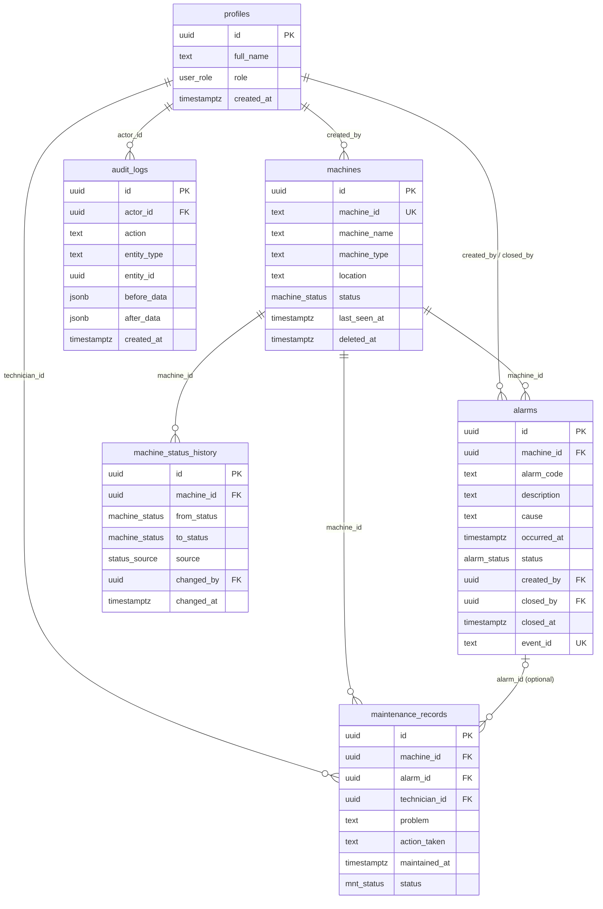

# 04 — Database Schema Design

**ระบบ:** Alarm & Maintenance Management System (AMMS)
**ฐานข้อมูล:** Supabase (PostgreSQL 15)
**อ้างอิง:** [01-requirement-analysis.md](01-requirement-analysis.md) · [03-architecture.md](03-architecture.md)
**ไฟล์ DDL สำหรับรัน:** `supabase/schema.sql` (เนื้อหาเดียวกับ §5 ของเอกสารนี้)

---

## 1. ERD



---

## 2. ตารางและเหตุผลของการออกแบบ

| ตาราง | หน้าที่ | REQ ที่รองรับ |
|---|---|---|
| `profiles` | ข้อมูลผู้ใช้และ Role ผูก 1:1 กับ `auth.users` | REQ-AUTH-03…06 |
| `machines` | Machine Master + สถานะปัจจุบัน + Soft Delete | REQ-MCH-01…06 |
| `alarms` | Alarm Record และวงจรสถานะ | REQ-ALM-01…06 |
| `maintenance_records` | งานซ่อมบำรุงและผลการแก้ไข | REQ-MNT-01…05 |
| `machine_status_history` | ประวัติการเปลี่ยนสถานะเครื่อง (append-only) | REQ-BON-03, REQ-BON-09 |
| `audit_logs` | ร่องรอยการเปลี่ยนแปลงข้อมูลสำคัญ (append-only) | REQ-SEC-06, REQ-BON-05 |

### 2.1 การตัดสินใจสำคัญ

| ประเด็น | ตัดสินใจ | เหตุผล |
|---|---|---|
| Primary Key | `uuid` ทุกตาราง | ไม่เปิดเผยจำนวนข้อมูล และสร้างฝั่ง DB ได้ |
| `machines.machine_id` | เก็บเป็น text + `UNIQUE` แยกจาก PK | เป็นรหัสธุรกิจที่มนุษย์ใช้ ต้องเปลี่ยนได้โดยไม่กระทบ FK ของตารางลูก (REQ-MCH-03) |
| สถานะทุกตัว | Postgres `enum` | ค่าที่ไม่อยู่ใน list เข้าฐานข้อมูลไม่ได้เลย ([ADR-003](adr/ADR-003-status-enum-and-db-constraints.md)) |
| การลบ Machine | Soft Delete ด้วย `deleted_at` + FK `on delete restrict` | ประวัติ Alarm/งานซ่อมต้องไม่หาย (REQ-MCH-05, BR-06) |
| `maintenance_records.alarm_id` | nullable + `on delete set null` | งานซ่อมบางใบเป็นงาน PM ที่ไม่ได้มาจาก Alarm (REQ-MNT-02) |
| `alarms.event_id` | text nullable + `UNIQUE` | ใช้เป็น Idempotency Key เมื่อรับ Alarm จาก Gateway ใน v2 (FM-07) |
| `machines.last_seen_at` | timestamptz nullable | ให้ UI แสดงได้ว่าข้อมูลสถานะสดหรือล้าสมัย (FM-06) |
| `audit_logs` | ไม่มี Policy สำหรับ UPDATE/DELETE | ทำให้เป็น append-only จริงในระดับฐานข้อมูล |
| Default role ของผู้ใช้ใหม่ | `viewer` | สิทธิ์ต่ำสุด — ป้องกัน privilege escalation โดยไม่ตั้งใจ (REQ-AUTH-04) |

---

## 3. Constraint Matrix

Business Rule ที่ถูกบังคับในระดับฐานข้อมูล ไม่พึ่งโค้ดแอปเพียงชั้นเดียว (NFR-INT-01)

| Rule | บังคับด้วย | ชื่อ Constraint |
|---|---|---|
| BR-01 Machine ID ไม่ซ้ำ | UNIQUE | `machines_machine_id_key` |
| BR-01 Machine ID ตรงรูปแบบ | CHECK | `machines_machine_id_format` |
| BR-03 ปิด Alarm ต้องมี Cause + closed_by + closed_at | CHECK | `alarms_closed_requires_cause` |
| BR-04 Maintenance Done ต้องมี Action Taken | CHECK | `mnt_done_requires_action` |
| BR-06 ห้ามลบ Machine ที่มีลูกอ้างถึง | FK `on delete restrict` | `alarms_machine_id_fkey`, `mnt_machine_id_fkey` |
| BR-07 ห้ามเปลี่ยน Role ตัวเอง | RLS Policy | `profiles_admin_update_others` |
| BR-08 Occurred At ไม่เป็นอนาคต | **Trigger** | `trg_alarms_check_occurred_at` |
| FM-07 Event จาก Gateway ไม่ซ้ำ | UNIQUE | `alarms_event_id_key` |
| ห้ามแก้/ลบ Audit Log | ไม่มี Policy = Deny | — |

> **หมายเหตุทางเทคนิค:** BR-08 ใช้ **Trigger ไม่ใช่ CHECK** เพราะ PostgreSQL บังคับให้ฟังก์ชันใน CHECK constraint ต้องเป็น `IMMUTABLE` แต่ `now()` เป็น `STABLE` การเขียน `CHECK (occurred_at <= now())` จะถูกปฏิเสธตอนสร้างตาราง

---

## 4. RLS Policy Matrix

| ตาราง | SELECT | INSERT | UPDATE | DELETE |
|---|---|---|---|---|
| `profiles` | ตัวเอง หรือ admin | ไม่มี Policy (สร้างผ่าน trigger เท่านั้น) | admin **และไม่ใช่แถวของตัวเอง** | ไม่มี Policy |
| `machines` | ทุกคนที่ Login | admin | admin | ไม่มี Policy (ใช้ Soft Delete) |
| `alarms` | ทุกคนที่ Login | admin, technician | admin, technician | ไม่มี Policy |
| `maintenance_records` | ทุกคนที่ Login | admin, technician | admin, technician | ไม่มี Policy |
| `machine_status_history` | ทุกคนที่ Login | admin (Simulator) | ไม่มี Policy | ไม่มี Policy |
| `audit_logs` | admin | ทุกคนที่ Login (ต้องเป็น actor ของตัวเอง) | ไม่มี Policy | ไม่มี Policy |

**หลักที่ใช้:** RLS เป็น **Default Deny** — ไม่เขียน Policy ให้ operation ใด แปลว่า operation นั้นทำไม่ได้ ไม่ต้องเขียน Policy ปฏิเสธ

**ความต่างสำคัญจากแบบทั่วไป:** Policy ของ `profiles` สำหรับ UPDATE มีเงื่อนไข `id <> auth.uid()` ทำให้กฎ "ห้ามเปลี่ยน Role ตัวเอง" (BR-07) ถูกบังคับที่ **ชั้นฐานข้อมูล** ไม่ใช่แค่ใน Server Action — ถึง Admin จะยิง Data API ตรงด้วย Token ของตัวเองก็ยกระดับสิทธิ์ตัวเองไม่ได้

---

## 5. DDL ฉบับเต็ม

> รันไฟล์นี้ใน Supabase SQL Editor ตามลำดับจากบนลงล่าง

```sql
-- =====================================================================
-- AMMS — Alarm & Maintenance Management System
-- Supabase / PostgreSQL Schema  (v1.0)
-- =====================================================================

-- ---------------------------------------------------------------------
-- 1. ENUM TYPES
-- ---------------------------------------------------------------------
create type user_role      as enum ('admin', 'technician', 'viewer');
create type machine_status as enum ('Running', 'Stop', 'Alarm', 'Maintenance');
create type alarm_status   as enum ('Open', 'In Progress', 'Closed');
create type mnt_status     as enum ('Open', 'In Progress', 'Waiting Part', 'Done');
create type status_source  as enum ('manual', 'simulator', 'plc');

-- ---------------------------------------------------------------------
-- 2. TABLES
-- ---------------------------------------------------------------------

-- PROFILES : ผูก 1:1 กับ auth.users เก็บ role
create table profiles (
  id         uuid primary key references auth.users(id) on delete cascade,
  full_name  text        not null check (btrim(full_name) <> ''),
  role       user_role   not null default 'viewer',
  created_at timestamptz not null default now(),
  updated_at timestamptz not null default now()
);

-- MACHINES : Machine Master + สถานะปัจจุบัน + soft delete
create table machines (
  id              uuid primary key default gen_random_uuid(),
  machine_id      text           not null unique,
  machine_name    text           not null check (btrim(machine_name) <> ''),
  machine_type    text           not null check (btrim(machine_type) <> ''),
  location        text           not null check (btrim(location)     <> ''),
  status          machine_status  not null default 'Running',
  last_seen_at    timestamptz,                    -- ล่าสุดที่ได้ข้อมูลจาก PLC (v2)
  deleted_at      timestamptz,                    -- soft delete
  created_by      uuid references profiles(id) on delete set null,
  created_at      timestamptz    not null default now(),
  updated_at      timestamptz    not null default now(),
  constraint machines_machine_id_format
    check (machine_id ~ '^[A-Za-z0-9-]{2,20}$')
);

-- ALARMS : Alarm Record
create table alarms (
  id          uuid primary key default gen_random_uuid(),
  machine_id  uuid          not null references machines(id) on delete restrict,
  alarm_code  text          not null check (btrim(alarm_code)  <> ''),
  description text          not null check (btrim(description) <> ''),
  cause       text,
  occurred_at timestamptz   not null default now(),
  status      alarm_status  not null default 'Open',
  created_by  uuid references profiles(id) on delete set null,
  closed_by   uuid references profiles(id) on delete set null,
  closed_at   timestamptz,
  event_id    text unique,                        -- idempotency key จาก gateway (v2)
  created_at  timestamptz   not null default now(),
  updated_at  timestamptz   not null default now(),
  -- BR-03 : ปิด Alarm ต้องมี cause + ผู้ปิด + เวลาปิด
  constraint alarms_closed_requires_cause
    check (
      status <> 'Closed'
      or (btrim(coalesce(cause, '')) <> '' and closed_at is not null and closed_by is not null)
    ),
  -- ถ้ายังไม่ปิด ต้องไม่มีข้อมูลการปิดหลงเหลือ
  constraint alarms_open_has_no_close_data
    check (status = 'Closed' or (closed_at is null and closed_by is null))
);

-- MAINTENANCE RECORDS : งานซ่อมบำรุง
create table maintenance_records (
  id            uuid primary key default gen_random_uuid(),
  machine_id    uuid        not null references machines(id) on delete restrict,
  alarm_id      uuid        references alarms(id)   on delete set null,
  technician_id uuid        references profiles(id) on delete set null,
  problem       text        not null check (btrim(problem) <> ''),
  action_taken  text,
  maintained_at timestamptz not null default now(),
  status        mnt_status  not null default 'Open',
  created_by    uuid references profiles(id) on delete set null,
  created_at    timestamptz not null default now(),
  updated_at    timestamptz not null default now(),
  -- BR-04 : ปิดงานต้องมี action_taken
  constraint mnt_done_requires_action
    check (status <> 'Done' or btrim(coalesce(action_taken, '')) <> '')
);

-- MACHINE STATUS HISTORY : append-only รองรับหน้า Machine History
create table machine_status_history (
  id          uuid primary key default gen_random_uuid(),
  machine_id  uuid           not null references machines(id) on delete cascade,
  from_status machine_status,
  to_status   machine_status not null,
  source      status_source  not null default 'manual',
  changed_by  uuid references profiles(id) on delete set null,
  changed_at  timestamptz    not null default now()
);

-- AUDIT LOGS : append-only
create table audit_logs (
  id          uuid primary key default gen_random_uuid(),
  actor_id    uuid references profiles(id) on delete set null,
  actor_role  user_role,
  action      text not null,          -- เช่น 'alarm.close', 'machine.update', 'user.role_change'
  entity_type text not null,          -- 'machine' | 'alarm' | 'maintenance' | 'profile'
  entity_id   uuid,
  before_data jsonb,
  after_data  jsonb,
  created_at  timestamptz not null default now()
);

-- ---------------------------------------------------------------------
-- 3. INDEXES
-- ---------------------------------------------------------------------
create index idx_machines_status       on machines(status) where deleted_at is null;
create index idx_machines_active       on machines(deleted_at);
create index idx_machines_search       on machines(machine_id, machine_name);

create index idx_alarms_machine        on alarms(machine_id);
create index idx_alarms_status         on alarms(status);
create index idx_alarms_occurred       on alarms(occurred_at desc);
create index idx_alarms_code           on alarms(alarm_code);
create index idx_alarms_open           on alarms(machine_id) where status <> 'Closed';

create index idx_mnt_machine           on maintenance_records(machine_id);
create index idx_mnt_status            on maintenance_records(status);
create index idx_mnt_technician        on maintenance_records(technician_id);
create index idx_mnt_date              on maintenance_records(maintained_at desc);

create index idx_history_machine       on machine_status_history(machine_id, changed_at desc);
create index idx_audit_entity          on audit_logs(entity_type, entity_id);
create index idx_audit_created         on audit_logs(created_at desc);

-- ---------------------------------------------------------------------
-- 4. TRIGGER FUNCTIONS
-- ---------------------------------------------------------------------

-- 4.1 updated_at อัตโนมัติ
create or replace function set_updated_at()
returns trigger language plpgsql as $$
begin
  new.updated_at := now();
  return new;
end;
$$;

create trigger trg_profiles_updated  before update on profiles
  for each row execute function set_updated_at();
create trigger trg_machines_updated  before update on machines
  for each row execute function set_updated_at();
create trigger trg_alarms_updated    before update on alarms
  for each row execute function set_updated_at();
create trigger trg_mnt_updated       before update on maintenance_records
  for each row execute function set_updated_at();

-- 4.2 BR-08 : occurred_at ต้องไม่เป็นอนาคต
--     ใช้ trigger เพราะ CHECK constraint ห้ามใช้ฟังก์ชันที่ไม่ IMMUTABLE เช่น now()
create or replace function check_occurred_at_not_future()
returns trigger language plpgsql as $$
begin
  if new.occurred_at > now() + interval '1 minute' then   -- เผื่อ clock skew 1 นาที
    raise exception 'occurred_at must not be in the future'
      using errcode = 'check_violation';
  end if;
  return new;
end;
$$;

create trigger trg_alarms_check_occurred_at
  before insert or update of occurred_at on alarms
  for each row execute function check_occurred_at_not_future();

-- 4.3 บันทึกประวัติเมื่อสถานะเครื่องเปลี่ยน
create or replace function log_machine_status_change()
returns trigger language plpgsql security definer set search_path = public as $$
begin
  if new.status is distinct from old.status then
    insert into machine_status_history (machine_id, from_status, to_status, source, changed_by)
    values (new.id, old.status, new.status, 'manual', auth.uid());
  end if;
  return new;
end;
$$;

create trigger trg_machines_status_history
  after update of status on machines
  for each row execute function log_machine_status_change();

-- 4.4 สร้าง profile อัตโนมัติเมื่อมี user ใหม่ (role ต่ำสุด)
create or replace function handle_new_user()
returns trigger language plpgsql security definer set search_path = public as $$
begin
  insert into profiles (id, full_name, role)
  values (
    new.id,
    coalesce(
      nullif(btrim(new.raw_user_meta_data ->> 'full_name'), ''),
      split_part(coalesce(new.email, 'user'), '@', 1)
    ),
    'viewer'                      -- REQ-AUTH-04 : สิทธิ์ต่ำสุดเป็นค่าตั้งต้น
  )
  on conflict (id) do nothing;
  return new;
end;
$$;

drop trigger if exists on_auth_user_created on auth.users;
create trigger on_auth_user_created
  after insert on auth.users
  for each row execute function handle_new_user();

-- ---------------------------------------------------------------------
-- 5. RLS HELPER
-- ---------------------------------------------------------------------
-- security definer เพื่ออ่าน profiles ได้แม้ policy จะจำกัด
-- set search_path ป้องกัน search_path hijacking
create or replace function current_role_name()
returns user_role
language sql stable security definer set search_path = public as $$
  select role from profiles where id = auth.uid();
$$;

revoke all on function current_role_name() from public, anon;
grant execute on function current_role_name() to authenticated, service_role;

-- ---------------------------------------------------------------------
-- 6. ROW LEVEL SECURITY
-- ---------------------------------------------------------------------
alter table profiles              enable row level security;
alter table machines              enable row level security;
alter table alarms                enable row level security;
alter table maintenance_records   enable row level security;
alter table machine_status_history enable row level security;
alter table audit_logs            enable row level security;

-- ---------- PROFILES ----------
create policy profiles_select_self_or_admin on profiles
  for select to authenticated
  using (id = auth.uid() or current_role_name() = 'admin');

-- BR-07 : admin แก้ role ของคนอื่นได้ แต่ของตัวเองไม่ได้ — บังคับที่ชั้น DB
create policy profiles_admin_update_others on profiles
  for update to authenticated
  using      (current_role_name() = 'admin' and id <> auth.uid())
  with check (current_role_name() = 'admin' and id <> auth.uid());

-- ---------- MACHINES ----------
create policy machines_select_authenticated on machines
  for select to authenticated
  using (true);

create policy machines_admin_insert on machines
  for insert to authenticated
  with check (current_role_name() = 'admin');

create policy machines_admin_update on machines
  for update to authenticated
  using      (current_role_name() = 'admin')
  with check (current_role_name() = 'admin');
-- ไม่มี DELETE policy → ลบจริงไม่ได้ ใช้ soft delete ผ่าน UPDATE เท่านั้น

-- ---------- ALARMS ----------
create policy alarms_select_authenticated on alarms
  for select to authenticated
  using (true);

create policy alarms_staff_insert on alarms
  for insert to authenticated
  with check (current_role_name() in ('admin', 'technician'));

create policy alarms_staff_update on alarms
  for update to authenticated
  using      (current_role_name() in ('admin', 'technician'))
  with check (current_role_name() in ('admin', 'technician'));

-- ---------- MAINTENANCE RECORDS ----------
create policy mnt_select_authenticated on maintenance_records
  for select to authenticated
  using (true);

create policy mnt_staff_insert on maintenance_records
  for insert to authenticated
  with check (current_role_name() in ('admin', 'technician'));

create policy mnt_staff_update on maintenance_records
  for update to authenticated
  using      (current_role_name() in ('admin', 'technician'))
  with check (current_role_name() in ('admin', 'technician'));

-- ---------- MACHINE STATUS HISTORY (append-only) ----------
create policy history_select_authenticated on machine_status_history
  for select to authenticated
  using (true);

create policy history_admin_insert on machine_status_history
  for insert to authenticated
  with check (current_role_name() = 'admin');

-- ---------- AUDIT LOGS (append-only, อ่านได้เฉพาะ admin) ----------
create policy audit_admin_select on audit_logs
  for select to authenticated
  using (current_role_name() = 'admin');

create policy audit_self_insert on audit_logs
  for insert to authenticated
  with check (actor_id = auth.uid());

-- ---------------------------------------------------------------------
-- 7. GRANTS — Least Privilege  (REQ-SEC-05)
-- ---------------------------------------------------------------------
-- ถอนสิทธิ์ของ anon ออกจากตารางข้อมูลทั้งหมด
-- เพื่อไม่ให้ตารางที่เพิ่มในอนาคตแล้วลืมเปิด RLS รั่วสู่ผู้ที่ยังไม่ Login
revoke all on all tables    in schema public from anon;
revoke all on all sequences in schema public from anon;
revoke all on all functions in schema public from anon;
revoke usage on schema public from anon;

alter default privileges in schema public revoke all on tables    from anon;
alter default privileges in schema public revoke all on sequences from anon;
alter default privileges in schema public revoke all on functions from anon;

-- ให้สิทธิ์เฉพาะผู้ที่ Login แล้ว โดยยังผ่าน RLS เป็นชั้นบังคับ
grant usage on schema public to authenticated, service_role;
grant select, insert, update on
  profiles, machines, alarms, maintenance_records,
  machine_status_history, audit_logs
  to authenticated;
grant all on all tables in schema public to service_role;

-- ---------------------------------------------------------------------
-- 8. SEED (ตัวอย่าง — รันหลังสร้าง user ใน Authentication แล้ว)
-- ---------------------------------------------------------------------
-- 1) สร้าง user ใน Supabase Dashboard > Authentication > Users
-- 2) trigger จะสร้าง profile ให้อัตโนมัติด้วย role = 'viewer'
-- 3) ยกระดับ role ของบัญชีผู้ดูแลชุดแรกด้วยคำสั่งนี้ (ครั้งเดียว)
--
-- update profiles set role = 'admin'
--  where id = (select id from auth.users where email = 'admin@example.com');
--
-- insert into machines (machine_id, machine_name, machine_type, location) values
--   ('M-001', 'CNC Lathe 01',    'CNC',        'Line A'),
--   ('M-002', 'Injection 02',    'Molding',    'Line B'),
--   ('M-003', 'Conveyor 03',     'Conveyor',   'Line A'),
--   ('M-004', 'Robot Arm 04',    'Robot',      'Line C');
```

---

## 6. Query สำคัญของ Dashboard

เขียนไว้ล่วงหน้าเพื่อยืนยันว่า Index ที่ออกแบบใช้งานได้จริง และเป็นไปตาม QAS-01 (นับที่ฐานข้อมูล ไม่ดึงทุกแถวไป Client)

```sql
-- REQ-DSH-01, REQ-DSH-02 : จำนวนเครื่องทั้งหมดและแยกตามสถานะ
select status, count(*) as total
from machines
where deleted_at is null
group by status;                        -- ใช้ idx_machines_status

-- REQ-DSH-03 : Alarm ค้างและงานซ่อมค้าง
select
  (select count(*) from alarms a
     join machines m on m.id = a.machine_id
    where a.status <> 'Closed' and m.deleted_at is null) as open_alarms,
  (select count(*) from maintenance_records r
     join machines m on m.id = r.machine_id
    where r.status <> 'Done'   and m.deleted_at is null) as open_maintenance;

-- REQ-DSH-04 : จำนวน Alarm ต่อวัน 30 วันล่าสุด (กราฟ)
select date_trunc('day', occurred_at)::date as day, count(*) as total
from alarms
where occurred_at >= now() - interval '30 days'
group by 1
order by 1;                             -- ใช้ idx_alarms_occurred

-- REQ-BON-02 : Top 5 Alarm Code
select alarm_code, count(*) as total
from alarms
where occurred_at >= now() - interval '30 days'
group by alarm_code
order by total desc
limit 5;                                -- ใช้ idx_alarms_code
```

---

## 7. แผนการเปลี่ยนแปลง Schema (Migration)

| Change Request | คำสั่งที่ต้องรัน | กระทบ |
|---|---|---|
| เพิ่มสถานะงานซ่อม | `alter type mnt_status add value 'Scrapped';` | เพิ่ม label + transition (ไม่ต้องแก้ตาราง) |
| เพิ่ม Role ใหม่ | `alter type user_role add value 'manager';` | **ต้องทบทวน RLS Policy ทุกข้อ** |
| เพิ่มข้อมูล Technician | `alter table profiles add column phone text;` | ต่ำ |
| บังคับ 1 Alarm ต่อ 1 งานซ่อม | `create unique index ... on maintenance_records(alarm_id) where alarm_id is not null;` | ต้องยืนยัน OQ-04 ก่อน |
| รับสถานะจาก PLC | ไม่ต้องแก้ตาราง — ใช้ `last_seen_at`, `event_id`, `status_source` ที่เตรียมไว้แล้ว | ต่ำ (ตามเจตนาของ [ADR-004](adr/ADR-004-plc-integration-boundary.md)) |

> `alter type ... add value` ไม่สามารถรันภายใน transaction block เดียวกับการใช้ค่านั้นได้ — ต้องแยกเป็น migration 2 ขั้น

---

## สรุป

Schema นี้มี 6 ตาราง 5 enum และบังคับ Business Rule ไว้ในฐานข้อมูล 9 จุด (UNIQUE 2, CHECK 4, FK restrict 2, Trigger 1) พร้อม RLS แบบ Default Deny ทุกตาราง จุดที่ต่างจากแบบทั่วไปคือ **กฎห้ามเปลี่ยน Role ตัวเองถูกบังคับใน RLS** และ **`anon` ถูกถอนสิทธิ์ทั้งหมด** ทำให้ตารางที่เพิ่มในอนาคตแล้วลืมเปิด RLS ยังไม่รั่วสู่ผู้ที่ไม่ได้ Login
